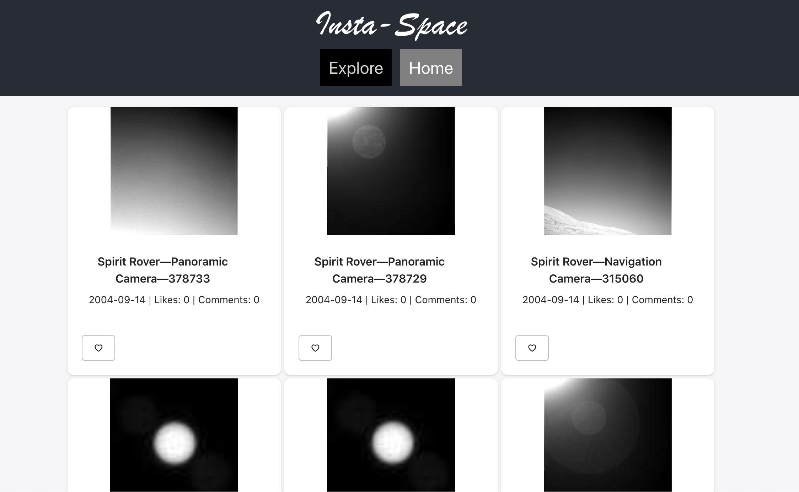

# Insta-Space


## Demo of App In Development

A demo of some of this app's features is currently available [here](https://insta-space.netlify.app).



## Purpose and Usage

Welcome to Insta-Space! You can browse images from Nasa's space exploration (currently Mars Rovers Pictures) and add where you can like images you find appealing.

First, fork, clone, and install the [Rails Api](https://github.com/DavidRMorphew/insta_space_backend).

Then fork this repository.

Clone it:
```
git clone git@github.com:DavidRMorphew/insta_space_frontend.git
```
Run
```
npm install
```
## Features Built for the Future

Currently, this Api persists users and provides authentication using JSON Web Tokens and persisted user information in the Rails Api, and web tokens in localStorage in this React Frontend.

User authentication is intended for future functionality with persisted user likes, comments, and responses to comments. For the future plans to add comments, replies, and persist user likes, see the  [drawio diagram](/Users/Morpheus299800/Projects/coding_challenges/my-insta-space-split/insta-space-backend/insta_space_backend/database_table.png) located in the Rails Api.

This app is also intended to fetch images from other NASA Apis in future versions.

Some of these features are apparent in the Card display of Rover Images. The likes count and comment count, for instance, will display likes and comments of users that are persisted in the Rails Api database.

## Under the Hood

This React App utilizes React-Redux and Redux-Thunk and combinedReducers. Currently, only the user, likes, and loading reducers and in use, but some of the tracks have been laid for the use of the likes reducer.

## Contributing

Pull requests are welcome. If you want to make major changes, please open an issue first to discuss the proposed change.

Please feel free to add and update tests where appropriate.

Contributors are expected to adhere to the [Contributor Covenant](https://www.contributor-covenant.org/) code of conduct.

## License

The app is open source under the terms of the [MIT License](https://github.com/DavidRMorphew/insta_space_frontend/blob/main/LICENSE.TXT).